</img>

### :space_invader: &nbsp;À propos de moi

&nbsp;&nbsp;&nbsp; :technologist: &nbsp;Ingénieur Logiciel (Remote), je construis en public.\
&nbsp;&nbsp;&nbsp; :hammer_and_wrench: &nbsp;En train de construire [sui-runner](https://github.com/MikeyA-yo) — un outil CLI Web3 pour Sui permettant de démarrer des projets de smart contracts, écrit en Rust.\
&nbsp;&nbsp;&nbsp; :seedling: &nbsp;Étudiant en ingénierie des systèmes, j'approfondis le Web3 et la programmation bas niveau.\
&nbsp;&nbsp;&nbsp; :brain: &nbsp;J'affine mes structures de données et algorithmes au quotidien — toujours en train d'apprendre, toujours en train de construire.\
&nbsp;&nbsp;&nbsp; :heartbeat: &nbsp;Passionné par la résolution de problèmes concrets et la création de produits de qualité.

  &nbsp;&nbsp;&nbsp;&nbsp;
  &nbsp;&nbsp;&nbsp;&nbsp;
  &nbsp;&nbsp;&nbsp;&nbsp;
  &nbsp;&nbsp;&nbsp;&nbsp;

  
<b>:computer: &nbsp;Principales connaissances technologiques</b>

   

&nbsp;
&nbsp;
&nbsp;
&nbsp;
&nbsp;\
&nbsp;
&nbsp;
&nbsp;\
&nbsp;
&nbsp;
&nbsp;\
&nbsp;
&nbsp;
&nbsp;
&nbsp;

  
<b>:brain: &nbsp;Autres connaissances, toujours en train d'apprendre</b>

   

&nbsp;
&nbsp;
&nbsp;\
&nbsp;
&nbsp;
&nbsp;
&nbsp;\
&nbsp;
&nbsp;
&nbsp;
&nbsp;

  
<b>:gear: &nbsp;Statistiques GitHub</b>

   
    

        
    

    

         
    

